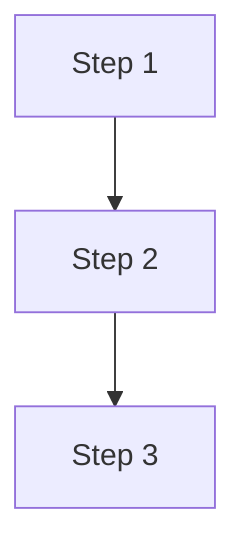
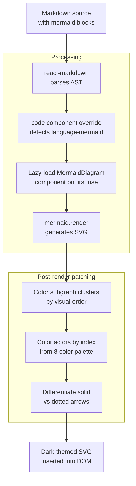
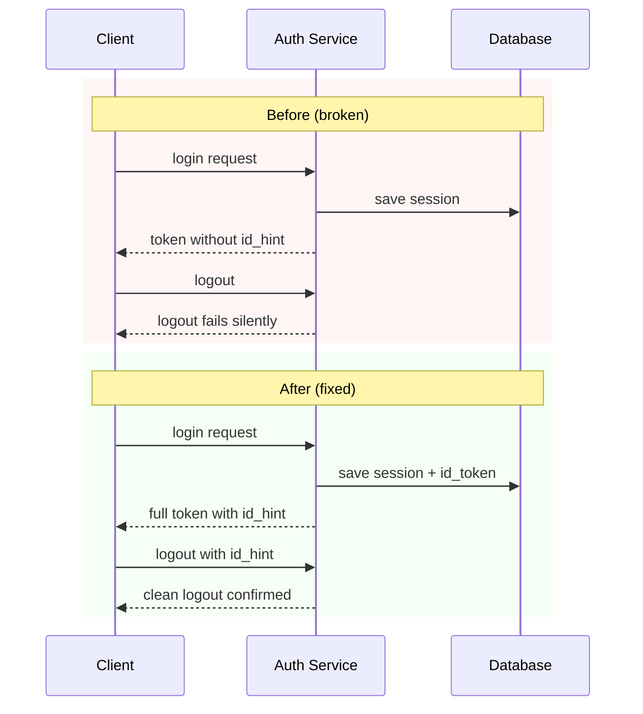

### TLDR:

I added Mermaid diagram rendering to my markdown-based tools. The feature auto-colors flowchart subgraphs (red for broken paths, green for fixed), gives each sequence diagram actor its own color, and differentiates solid vs dotted arrows. Getting there meant bypassing the library's syntax highlighting, patching SVG elements post-render, and learning that CSS specificity beats SVG attributes every time.

---

## The Problem: Diagrams Rendered as Code Blocks

My design docs are markdown files. When a document describes a multi-service authentication flow with an Angular frontend handing off tokens to a React app, the text gets dense fast. A diagram makes it instantly clear. Mermaid is the obvious choice — you write a text description, it renders a diagram:

````

````

Except my markdown renderer (react-markdown) just showed the raw text. No diagram. Just a code block with the word "mermaid" at the top.

## The Solution Architecture

Here's how the rendering pipeline works:



The key insight: don't fight the library at the configuration level. Let mermaid render its default output, then patch the SVG DOM afterward.

## Three Problems I Didn't Expect

### 1. The Syntax Highlighter Ate My Diagram

If your markdown pipeline includes a syntax highlighter like `rehype-highlight`, it processes code blocks *before* your React component overrides. The highlighter wraps mermaid keywords in `<span>` elements for coloring. When your component tries to extract the chart text with `String(children)`, you get `[object Object]` instead of the flowchart definition.

**Fix:** Tell the highlighter to skip mermaid. Most support an ignore list — `rehype-highlight` has `plainText: ['mermaid']`. If yours doesn't, use a remark plugin that converts the code block to a different node type before the highlighter runs.

### 2. Mermaid's Dark Theme Isn't Dark Enough

Setting `theme: 'dark'` in mermaid's config gives you... a slightly less white background. Sequence diagrams still render with bright white backgrounds, light gray actors, and nearly invisible text. The `themeVariables` option covers flowcharts reasonably well, but sequence diagrams ignore most of them.

**Fix:** Switch to `theme: 'base'` for full control, then patch the rendered SVG:

```
el.querySelectorAll('rect.actor').forEach(r => {
  r.style.fill = '#172554'   // dark blue
  r.style.stroke = '#1d4ed8' // blue border
})
```

Note: you **must** use `style.*` instead of `setAttribute()`. Mermaid's CSS classes have higher specificity than SVG presentation attributes.

### 3. The Parallelogram Parser Trap

Mermaid uses `[/text/]` for parallelogram shapes. If your node label starts with a slash — like `[/logout builds URL]` — the parser tries to match it as a parallelogram, fails to find the closing `/]`, and throws a cryptic "Lexical error."

**Fix:** Preprocess the chart text to quote labels that start with `/` or `\`:

```
src.replace(/\[([/\\])([^\]]*[^/\\])\]/g, '["$1$2"]')
```

## The Color System

The real payoff is automatic visual grouping. When you write a design doc comparing a broken flow with a fixed flow, the diagrams color themselves:



The rules are simple:
- **Flowcharts:** Subgraphs get colors by order (1st, 2nd, 3rd...). Nodes inside inherit the color.
- **Sequence diagrams:** `rect` sections get colors by vertical position. Each actor gets a unique color from an 8-color palette.
- **Arrows:** Solid lines (synchronous calls) render in blue. Dotted lines (async responses) render in amber.

No configuration needed. You write standard mermaid syntax, the renderer handles the rest.

## Implementation Takeaways

1. **Lazy-load mermaid.** The library is ~1.7MB. Dynamic `import()` ensures it only loads when a page actually contains a diagram.

2. **Post-render SVG patching is the way.** Fighting mermaid's theme system is a losing battle for anything beyond basic flowcharts. Let it render, then fix the DOM.

3. **CSS specificity matters in SVG.** Mermaid injects CSS classes. `setAttribute('fill', color)` sets an SVG *attribute* which has lower priority than CSS *properties*. Use `element.style.fill` instead.

4. **Clone markers for per-line colors.** SVG `<marker>` elements (arrowheads) are shared across all lines. To give dotted arrows a different color from solid arrows, clone the marker with a new ID and point the dotted lines to the clone.

5. **Test with a fresh browser.** Module-level `let initialized = false` flags persist across HMR reloads. When you change the mermaid config, the old config stays active until you hard-refresh.

## Try It Yourself

If you're rendering markdown with `react-markdown`, the core pattern is:

1. Add `mermaid` as a dependency
2. Create a lazy-loaded diagram component
3. Override the `code` component to detect `language-mermaid` and render your component
4. Override the `pre` component to unwrap the `<pre>` tag around diagrams
5. Patch the SVG after render for dark mode

The diagrams in this article are rendered using exactly this pipeline. No screenshots, no external services — just mermaid running in your browser.
