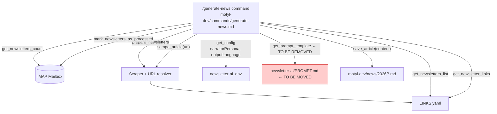
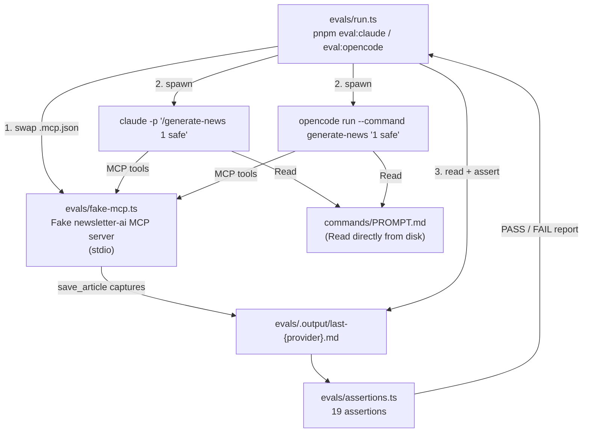

# Eval Tests for News Generation — Design Spec

**Date:** 2026-04-29  
**Status:** Approved  
**Scope:** `motyl-dev` — new `evals/` directory + PROMPT.md migration + `generate-news.md` update

---

## Problem

The `/generate-news` command produces articles via LLM. There is no automated way to verify that the output complies with the writing rules defined in `generate-news.md` and `PROMPT.md`. Regressions (persona leaking into output, em dashes appearing, missing required sections) are only caught by manual review.

---

## Solution

A standalone eval harness (`pnpm eval`) that:
1. Starts a fake `newsletter-ai` MCP server with deterministic fixture data
2. Runs `claude` or `opencode` CLI non-interactively with `/generate-news`
3. Captures the generated article
4. Asserts structural and quality rules

Two providers: `pnpm eval:claude` and `pnpm eval:opencode`. `pnpm eval` runs both sequentially.

---

## PROMPT.md Migration

**Current location:** `newsletter-ai/PROMPT.md`  
**New location:** `motyl-dev/commands/PROMPT.md`

**Why:** The prompt is an editorial asset (writing style, hashtag taxonomy, section format) that belongs with the publication tooling, not with the email/scraping service. The eval, the command, and the prompt all live together in `motyl-dev`.

**Change to `generate-news.md`:** Replace the `mcp__newsletter-ai__get_prompt_template` call with a direct `Read` of `commands/PROMPT.md`. The MCP no longer needs to serve the prompt.

**newsletter-ai cleanup:** Remove `getPromptTemplate` MCP tool and its registration in the MCP server. The tool currently has no other consumers.

---

## Current Production Flow



## Eval Flow (post-migration)



---

## File Structure

```
motyl-dev/
  commands/
    PROMPT.md                    # moved from newsletter-ai/PROMPT.md
    generate-news.md             # updated: Read ./commands/PROMPT.md, drop get_prompt_template
  evals/
    run.ts                       # runner: --provider flag, .mcp.json swap, spawn CLI, run assertions
    assertions.ts                # 19 assertion functions
    fixtures.ts                  # deterministic article content + newsletter metadata
    fake-mcp.ts                  # stdio MCP server (newsletter-ai protocol, fixture responses)
    .output/                     # gitignored — captured articles written by save_article
  package.json                   # + eval, eval:claude, eval:opencode scripts
```

---

## pnpm Scripts

```json
"eval:claude":   "tsx evals/run.ts --provider claude",
"eval:opencode": "tsx evals/run.ts --provider opencode",
"eval":          "pnpm eval:claude && pnpm eval:opencode"
```

---

## Fake MCP Server

**File:** `evals/fake-mcp.ts`  
**Transport:** stdio (spawned by the CLI as a child process via `.mcp.json`)  
**Library:** `@modelcontextprotocol/sdk`

### Fixture data (`evals/fixtures.ts`)

```
Newsletter:   { name: "JavaScript Weekly", uid: "eval-001" }
narratorPersona: "Sherlock Holmes"   ← known sentinel for leak detection
outputLanguage:  "EN"

Article 1:
  url:     https://example-eval.dev/turbopack-build-performance
  title:   "Turbopack reaches stable: what changed in build performance"
  content: "...Turbopack... build performance... 10x faster... Webpack migration..."

Article 2:
  url:     https://example-eval.dev/react-19-compiler-internals
  title:   "React 19 compiler internals: how auto-memoization works"
  content: "...React 19... compiler... auto-memoization... hooks... render cycles..."
```

### Tools implemented

| Tool | Response |
|------|----------|
| `get_newsletters_count` | `{ count: 1 }` |
| `prepare_newsletters` | `{ success: true }` |
| `get_newsletters_list` | fixture newsletter (1 item) |
| `get_config` | `{ narratorPersona: "Sherlock Holmes", outputLanguage: "EN", maxArticlesPerNewsletter: 5 }` |
| `get_newsletter_links` | 2 fixture article URLs |
| `scrape_article(url)` | deterministic content matched by URL |
| `save_article(content)` | writes to `evals/.output/last-{provider}.md` (provider from env) |
| `mark_newsletters_as_processed` | `{ success: true }` |
| `get_prompt_template` | **not implemented** — command reads PROMPT.md directly |

---

## MCP Swap Mechanism

The runner temporarily replaces `.mcp.json` with an eval-only version pointing to the fake server, then restores the original in a `finally` block:

```
.mcp.json → .mcp.json.eval-backup   (save original)
.mcp.json ← eval version            (fake server only)
spawn CLI
.mcp.json ← .mcp.json.eval-backup   (restore, always)
```

The eval `.mcp.json` sets `OUTPUT_PATH` to `evals/.output/` and `EVAL_PROVIDER` to the current provider name so `save_article` can name the output file correctly.

---

## Assertions (19 total)

### Structural (12) — format compliance

| # | Assertion |
|---|-----------|
| 1 | Output file exists and is non-empty |
| 2 | Has valid YAML frontmatter (`---` block) |
| 3 | `title` field present and non-empty |
| 4 | `excerpt` field present and non-empty |
| 5 | `publishedAt` matches `YYYY-MM-DD` |
| 6 | `slug` is URL-safe (`^[a-z0-9-]+$`) |
| 7 | `hashtags` field present and non-empty |
| 8 | `#generated` present in hashtags |
| 9 | At least one `## ` heading (article section) |
| 10 | At least one `**TLDR:**` occurrence |
| 11 | `**Key takeaways:**` present |
| 12 | `**Why do I care:**` present |

### Quality & Content (7) — writing rule compliance + content integrity

| # | Assertion |
|---|-----------|
| 13 | No em dash `—` anywhere in body |
| 14 | Narrator persona name ("Sherlock Holmes") not present in body |
| 15 | No "Co-Authored-By" in content |
| 16 | No "Generated with" in content |
| 17 | No banned AI vocabulary: `additionally`, `crucial`, `delve`, `landscape`, `pivotal`, `showcase`, `testament`, `vibrant`, `foster`, `enhance` |
| 18 | No fenced code blocks (` ``` `) in body |
| 19 | At least one fixture keyword present (`Turbopack` or `React 19`) — proves content was used |

---

## Provider Commands

| Provider | Command |
|----------|---------|
| Claude Code | `claude -p "/generate-news 1 safe"` |
| OpenCode | `opencode run --command generate-news "1 safe"` *(exact flag syntax to be verified — `--command` may or may not require the slash prefix)* |

Both run with `cwd = motyl-dev` and the swapped `.mcp.json`.

---

## Out of Scope

- Testing the `newsletter-ai` pipeline (IMAP, scraping, URL resolution) — covered by existing tests in newsletter-ai
- Testing body-only mode (The Batch) — can be a follow-up fixture
- CI integration — first iteration is local-only
- Scoring/metrics — pass/fail per assertion is sufficient for v1
