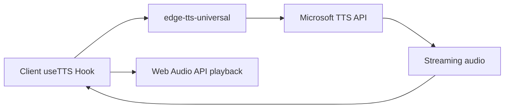

# TTS Migration Plan: edge-tts-universal

## Executive Summary

Migrate from server-side TTS (using `uvx edge-tts` via API route) to client-side TTS using the `edge-tts-universal` JavaScript library. This eliminates Vercel deployment issues with `uvx` availability and API timeouts.

## Current Architecture Analysis

### Current Implementation

```mermaid
flowchart LR
    A[Client useTTS Hook] --> B[/api/tts endpoint]
    B --> C[spawn uvx edge-tts]
    C --> D[Generate MP3 file]
    D --> E[Return audio buffer]
    E --> A
    A --> F[Web Audio API playback]
```

### Current Issues

| Issue                       | Description                                          | Impact                         |
| --------------------------- | ---------------------------------------------------- | ------------------------------ |
| **uvx not available**       | Vercel serverless functions don't have uvx installed | Complete failure in production |
| **API timeouts**            | 30s maxDuration limit, TTS generation can exceed     | Timeout errors for longer text |
| **Authentication required** | Requires user to be logged in                        | Barrier to usage               |
| **Server resource usage**   | CPU-intensive on server                              | Costs and cold starts          |

### Current Files

- [`hooks/useTTS.ts`](hooks/useTTS.ts) - Client-side hook managing audio playback
- [`app/api/tts/route.ts`](app/api/tts/route.ts) - Server-side API using `uvx edge-tts`
- [`lib/tts.ts`](lib/tts.ts) - Language detection utilities
- [`components/tts-player.tsx`](components/tts-player.tsx) - Full TTS player UI
- [`components/read-aloud-button.tsx`](components/read-aloud-button.tsx) - Browser SpeechSynthesis fallback

## Proposed Solution: edge-tts-universal

### What is edge-tts-universal?

A pure JavaScript/TypeScript implementation of Edge TTS that works directly in browsers without any server-side dependencies. It communicates directly with Microsoft's Cognitive Services speech synthesis API.

**Key Features:**

- Pure JavaScript - no Python or external dependencies
- Works in browsers and Node.js
- Streaming audio support
- Same voice quality as Microsoft Edge's Read Aloud
- No API keys required - uses public Microsoft endpoints

### New Architecture



### Benefits

| Benefit                      | Description                     |
| ---------------------------- | ------------------------------- |
| **No server dependency**     | Runs entirely in browser        |
| **No authentication needed** | Can remove login requirement    |
| **No timeout issues**        | Direct streaming from Microsoft |
| **Better UX**                | Faster response, no cold starts |
| **Lower costs**              | No server compute for TTS       |
| **Works everywhere**         | No uvx/Python dependency        |

## Implementation Plan

### Phase 1: Add edge-tts-universal Package

```bash
pnpm add edge-tts-universal
```

### Phase 2: Create New TTS Service

Create a new client-side TTS service that wraps edge-tts-universal:

```typescript
// lib/tts-client.ts
import { EdgeTTS } from 'edge-tts-universal'

export class TTSService {
  private tts: EdgeTTS

  constructor() {
    this.tts = new EdgeTTS()
  }

  async generateSpeech(text: string, voice: string): Promise<ArrayBuffer> {
    // Use edge-tts-universal to generate speech
  }

  async getVoices(): Promise<Voice[]> {
    // Return available voices
  }
}
```

### Phase 3: Update useTTS Hook

Modify [`hooks/useTTS.ts`](hooks/useTTS.ts) to use the new client-side service instead of fetching from `/api/tts`:

**Changes Required:**

1. Replace `fetch('/api/tts')` with direct `TTSService` calls
2. Remove dependency on server-side API
3. Handle streaming audio directly
4. Keep existing chunking logic for long texts

### Phase 4: Update Components

**[`components/tts-player.tsx`](components/tts-player.tsx):**

- Remove authentication check
- Simplify error handling

**[`components/read-aloud-button.tsx`](components/read-aloud-button.tsx):**

- Consider deprecating or keeping as fallback

### Phase 5: Clean Up

1. Remove or deprecate [`app/api/tts/route.ts`](app/api/tts/route.ts)
2. Update [`lib/tts.ts`](lib/tts.ts) if needed
3. Remove authentication requirement from TTS

## Technical Details

### edge-tts-universal API

```typescript
import { EdgeTTS } from 'edge-tts-universal'

// Initialize
const tts = new EdgeTTS()

// Generate speech
const audioBuffer = await tts.synthesize({
  text: 'Hello world',
  voice: 'en-GB-RyanNeural',
  // Optional: rate, pitch, volume
})

// Get available voices
const voices = await tts.getVoices()
```

### Voice Mapping

Current voices will continue to work:

| Language | Voice                |
| -------- | -------------------- |
| English  | `en-GB-RyanNeural`   |
| Polish   | `pl-PL-MarekNeural`  |
| German   | `de-DE-KatjaNeural`  |
| French   | `fr-FR-DeniseNeural` |
| Spanish  | `es-ES-ElviraNeural` |

### Browser Compatibility

| Browser         | Support         |
| --------------- | --------------- |
| Chrome          | ✅ Full support |
| Firefox         | ✅ Full support |
| Safari          | ✅ Full support |
| Edge            | ✅ Full support |
| Mobile browsers | ✅ Full support |

### Potential Challenges

1. **CORS Issues**
   - Microsoft's API should support CORS
   - May need to verify in testing

2. **Large Text Handling**
   - Keep existing chunking logic
   - Stream each chunk sequentially

3. **Network Reliability**
   - Add retry logic
   - Cache generated audio in memory

4. **Bundle Size**
   - edge-tts-universal adds ~50KB
   - Consider lazy loading

## Migration Steps

### Step 1: Install and Test

- [ ] Add `edge-tts-universal` package
- [ ] Create test page to verify browser functionality
- [ ] Test voice generation and audio quality

### Step 2: Create Service Layer

- [ ] Create `lib/tts-client.ts` service
- [ ] Implement streaming audio handling
- [ ] Add error handling and retries

### Step 3: Update Hook

- [ ] Modify `useTTS.ts` to use new service
- [ ] Keep existing chunking and progress logic
- [ ] Test pause/resume functionality

### Step 4: Update Components

- [ ] Remove authentication from `tts-player.tsx`
- [ ] Update error states
- [ ] Test all UI interactions

### Step 5: Cleanup

- [ ] Remove or deprecate `/api/tts` route
- [ ] Update documentation
- [ ] Remove unused dependencies

### Step 6: Testing

- [ ] Test on multiple browsers
- [ ] Test on mobile devices
- [ ] Test with long articles
- [ ] Test offline behavior

## Risk Assessment

| Risk                  | Likelihood | Impact | Mitigation                |
| --------------------- | ---------- | ------ | ------------------------- |
| CORS blocking         | Low        | High   | Test early, have fallback |
| Microsoft API changes | Low        | Medium | Monitor, version lock     |
| Bundle size increase  | Medium     | Low    | Lazy loading              |
| Browser compatibility | Low        | Medium | Test on all browsers      |

## Fallback Strategy

If edge-tts-universal doesn't work as expected:

1. **Keep existing `/api/tts` route** as fallback
2. **Use browser SpeechSynthesis** as secondary fallback
3. **Consider Web Speech API** with better voice selection

## Timeline Estimate

| Phase   | Description                      |
| ------- | -------------------------------- |
| Phase 1 | Package installation and testing |
| Phase 2 | Service layer creation           |
| Phase 3 | Hook modification                |
| Phase 4 | Component updates                |
| Phase 5 | Cleanup and documentation        |
| Phase 6 | Testing and verification         |

## Questions for User

1. Should we keep the authentication requirement for TTS, or remove it since there's no server cost?

2. Should we keep the `/api/tts` route as a fallback, or remove it entirely?

3. Do you want to keep the browser SpeechSynthesis fallback (`read-aloud-button.tsx`)?

4. Any specific voice preferences or should we keep the current voice mapping?
